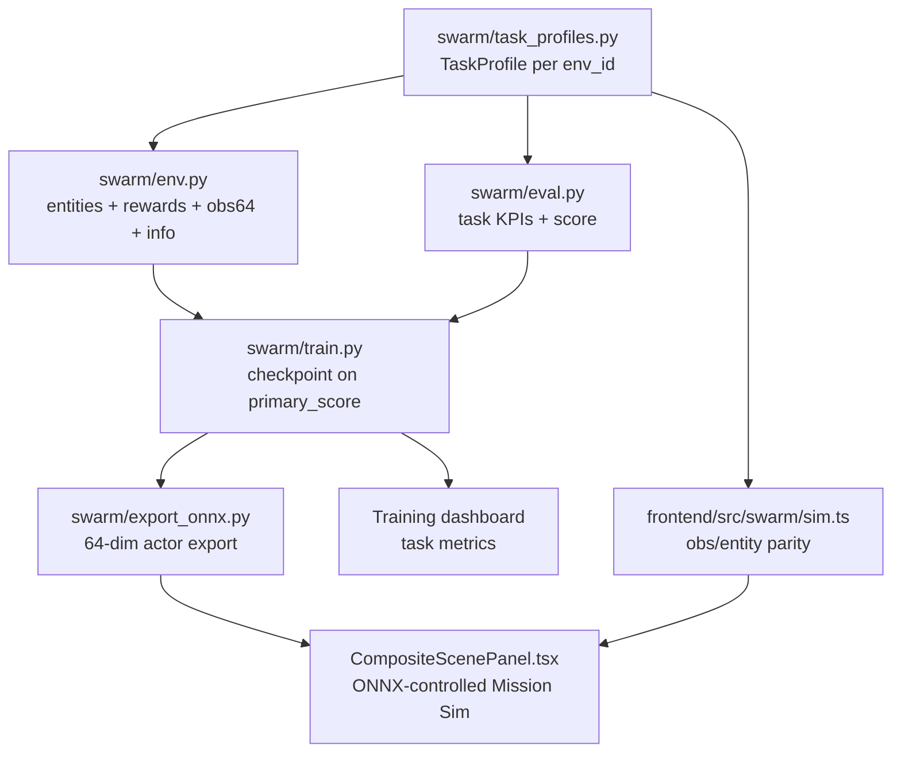

# Task-Realistic Policies — Implementation Reference

## Target outcome

At the end of this work, each gym environment should train and replay a policy that behaves like its actual scenario:

| Gym environment | Expected Mission Sim behavior |
|---|---|
| `drone-vs-drone` | Blue drones converge on hostile drones, eliminate them in sim, then hold a visible post-engagement orbit instead of sweeping map edges. |
| `moving-target-track` | Drones maintain custody around a moving target with separation and multi-angle coverage instead of maximizing grid coverage. |
| `search-and-interdict` | Drones search until contact, then switch from coverage to intercept behavior. |
| `defend-asset` | Drones hold an asset perimeter, intercept inbound hostiles, and avoid breach paths. |
| `swarm-vs-swarm-race` | Drones prioritize contested cells and rival pressure instead of pure left-to-right coverage. |

This document is the coding reference. Do not treat it as a loose roadmap: every implementation PR should map to the phases and acceptance criteria below.

---

## Current repo reality

This is the baseline to fix:

1. `swarm/env.py` is still fundamentally a coverage/search environment.
2. `swarm/env.py` currently exposes a 48-dimensional observation:
   - own state: 4
   - neighbors: 6
   - coverage patch: 25
   - obstacles: 12
   - role: 1
3. Hostile/task entities exist only partially and are not represented consistently in observations.
4. `swarm/train.py` evaluates and checkpoints on coverage, so the "best" policy can be the wrong mission policy.
5. `frontend/src/swarm/sim.ts` mirrors the current 48-dim inference contract, so any Python observation change must be mirrored there.
6. `frontend/src/panels/CompositeScenePanel.tsx` still uses `scriptedMissionActions(...)`; the Mission Sim looks active even when the trained policy is not controlling it.
7. Existing ONNX/checkpoint artifacts become stale when `OBS_DIM` changes.

---

## Non-goals for this pass

Keep scope tight. Do not mix these into the task-policy work:

- Full 3D physics RL. Training remains 2D point-mass; rendering remains 3D.
- LLM environment design.
- Dynamic `EnvironmentSpec`.
- Battlefield sliders reaching training/runtime task generation.
- Domain randomization across generated maps.
- Real-world targeting, real aircraft control, or hardware integration.

Those belong to the deferred environment-builder phase.

---

## Architecture decision

Use one shared `SwarmEnv`, plus a per-scenario `TaskProfile`.



Key rule: Python training env and TypeScript inference env must share the same observation contract and task entity semantics. If they diverge, the ONNX policy will look broken even if training improved.

---

## Observation contract

Move from `OBS_DIM=48` to `OBS_DIM=64`.

Current layout:

```text
[own: 4] + [neighbors: 6] + [coverage_patch: 25] + [obstacles: 12] + [role: 1] = 48
```

New layout:

```text
[base_obs: 47] + [task_feats: 16] + [role: 1] = 64
```

Important implementation detail: keep the role flag at the final index to minimize frontend/HUD assumptions. Insert the 16 task features before role.

Recommended constants:

```text
TASK_DIM = 16
BASE_WITHOUT_ROLE_DIM = OWN_DIM + NEIGHBOR_DIM + PATCH_DIM + OBSTACLE_DIM
OBS_DIM = BASE_WITHOUT_ROLE_DIM + TASK_DIM + ROLE_DIM
```

Task feature rules:

- Always length 16.
- Always normalized to approximately `[-1, 1]`.
- Always deterministic from local agent perspective.
- Zero-fill unused slots.
- Avoid scenario-specific observation lengths.
- Every feature used for reward shaping must either be locally observable or intentionally represented by a local cue.

---

## New file: `swarm/task_profiles.py`

Create a single source of truth for scenario-specific behavior.

### Data structures

Use dataclasses so `env.py`, `eval.py`, and docs can consume the same profile.

```python
@dataclass(frozen=True)
class TaskProfile:
    env_id: str
    primary_metric: str
    primary_mode: Literal["max", "min"]
    coverage_weight: float
    reward_weights: dict[str, float]
    task_dim: int = 16
    phase_names: tuple[str, ...] = ()
```

Add helper:

```python
def get_task_profile(env_id: str) -> TaskProfile
```

### Profile responsibilities

Each profile should define:

- task phase names
- coverage reward weight
- task reward weights
- primary checkpoint metric
- whether the metric is maximized or minimized
- task observation labels for debugging

Do not put mutable runtime state in the profile. Runtime state belongs in `SwarmEnv`.

---

## Phase 1 — Python task environment

Files:

- `swarm/task_profiles.py`
- `swarm/env.py`
- `swarm/scenarios.py`

### 1.1 Add common task state to `SwarmEnv`

Add fields initialized in `__init__` and reset in `reset()`:

- `self.task_profile`
- `self.task_phase`
- `self.task_events`
- `self.target_pos`
- `self.target_vel`
- `self.hostile_pos`
- `self.hostile_vel`
- `self.hostile_alive`
- `self.rival_pos`
- `self.contested_cells`
- `self.asset_pos`
- `self.breaches`
- `self.custody_steps`
- `self.contact_step`
- `self.intercept_step`
- `self.contested_score`
- `self.rival_score`

Only some fields are active per scenario; inactive fields remain empty/zero.

### 1.2 Update reset semantics

`reset()` must initialize task entities deterministically from the env seed:

- blue swarm spawn layout
- hostile positions and velocities
- moving target position and velocity
- asset position and inbound hostile lanes
- rival swarm positions
- contested cell map

Avoid using wall-clock time or frontend-only scripted routes. Training and inference must be replayable from seed.

### 1.3 Update step semantics

`step(actions)` should do this order:

1. apply attrition if configured
2. integrate blue agents
3. push blue agents out of obstacles
4. update task entities
5. compute contacts/kills/breaches/custody/contested ownership
6. mark coverage
7. compute reward from profile weights
8. return `info` with coverage and task metrics

The order matters because reward should reflect the post-action world state.

### 1.4 Add task observation block

Add a method:

```python
def _task_obs(self, agent_idx: int) -> np.ndarray:
    feats = np.zeros(TASK_DIM, dtype=np.float32)
    ...
    return feats
```

Then `_obs()` becomes:

```text
own + neighbors + patch + obstacles + task_obs + role
```

### 1.5 Add task metrics in info

Every `info` should include:

- `coverage`
- `n_alive`
- `task_score`
- `primary_metric`
- `primary_value`
- `task_phase`
- scenario-specific KPI fields

Use stable keys. The frontend and train event files should not need scenario-specific parsing just to show the primary score.

---

## Phase 2 — Scenario implementation details

### 2.1 `drone-vs-drone`

Goal: engage hostile drones, eliminate them, then orbit the engagement center.

State:

- `hostile_pos`: red drones spawned on right side or near contested center.
- `hostile_alive`: boolean per hostile.
- `hostile_vel`: simple patrol/orbit motion before elimination.
- `task_phase`: `engage` until all hostiles are dead, then `orbit`.

Task observation block:

| Slot | Feature |
|---:|---|
| 0-2 | nearest hostile 1: `dx`, `dy`, `alive` |
| 3-5 | nearest hostile 2: `dx`, `dy`, `alive` |
| 6 | hostile alive fraction |
| 7-8 | engagement center `dx`, `dy` |
| 9 | phase flag: engage `0`, orbit `1` |
| 10 | own radial error from desired orbit |
| 11 | own speed |
| 12-15 | reserved zero |

Rewards:

- large positive reward when a hostile is eliminated
- approach reward while hostiles are alive
- team spread penalty to avoid clumping
- post-kill orbit reward for holding radius around center
- low speed bonus while orbiting
- coverage weight `0.0` to `0.05`

Metrics:

- `hostiles_eliminated`
- `hostiles_alive`
- `kill_rate`
- `orbit_score`
- `task_score = 0.7 * kill_rate + 0.3 * orbit_score`

Acceptance:

- In Mission Sim, drones move toward hostiles within the first few seconds.
- Hostile count decreases during rollout.
- After elimination, drones orbit instead of sweeping the grid boundary.

### 2.2 `moving-target-track`

Goal: maintain custody of a moving target.

State:

- `target_pos`
- `target_vel`
- `custody_steps`
- `lost_track_steps`

Target kinematics:

- Use deterministic Lissajous or waypoint path inside world bounds.
- Use `battlefield.threat.moving_target_speed` if available.
- Bounce or turn before leaving bounds.

Task observation block:

| Slot | Feature |
|---:|---|
| 0-1 | target relative `dx`, `dy` |
| 2-3 | target velocity `vx`, `vy` |
| 4 | in custody flag for this agent |
| 5 | team custody flag |
| 6 | distance to custody radius |
| 7 | angular slot error around target |
| 8-9 | nearest teammate relative to target frame |
| 10 | target speed |
| 11 | lost-track fraction |
| 12-15 | reserved zero |

Rewards:

- dominant reward for team custody
- reward for multi-angle spread around target
- penalty for losing custody
- small coverage reward only to avoid local minima

Metrics:

- `custody_fraction`
- `lost_track_fraction`
- `mean_target_distance`
- `angle_spread_score`
- `task_score = 0.75 * custody_fraction + 0.25 * angle_spread_score`

Acceptance:

- Drones stay near the mover instead of covering the map.
- The dashboard custody metric increases during training.
- Mission Sim shows a moving target cue and drones tracking it.

### 2.3 `search-and-interdict`

Goal: search efficiently until contact, then converge and intercept.

State:

- hidden/contact target position
- `task_phase`: `search`, `contact`, `intercept`
- `contact_step`
- `intercept_step`
- `last_seen_pos`

Task observation block:

| Slot | Feature |
|---:|---|
| 0-2 | phase one-hot: search/contact/intercept |
| 3-4 | last-seen relative `dx`, `dy` |
| 5 | contact confidence |
| 6 | time since contact normalized |
| 7 | nearest unexplored frontier cue |
| 8 | intercept distance |
| 9 | intercept success flag |
| 10-15 | reserved zero |

Rewards:

- coverage reward only in search phase
- contact discovery bonus
- intercept approach reward after contact
- intercept success bonus
- penalty for slow response after contact

Metrics:

- `contact_made`
- `time_to_contact`
- `intercept_success`
- `time_to_intercept`
- `task_score = contact_score + intercept_score - time_penalty`

Acceptance:

- Before contact, drones spread/search.
- After contact, drones visibly converge.
- Checkpointing prefers policies that find and intercept, not just high coverage.

### 2.4 `defend-asset`

Goal: defend a fixed central asset from inbound hostiles.

State:

- `asset_pos = [0, 0]`
- inbound hostile positions/velocities
- `breaches`
- `intercepts`
- defended ring radius
- breach radius

Task observation block:

| Slot | Feature |
|---:|---|
| 0-1 | asset relative `dx`, `dy` |
| 2-4 | nearest inbound hostile `dx`, `dy`, alive |
| 5-6 | nearest hostile velocity `vx`, `vy` |
| 7 | hostile distance to asset |
| 8 | breach risk normalized |
| 9 | own ring radius error |
| 10 | sector assignment error |
| 11 | breaches normalized |
| 12-15 | reserved zero |

Rewards:

- large negative breach penalty
- intercept reward before breach radius
- ring standoff reward
- sector spread reward
- coverage weight `0.0`

Metrics:

- `breaches`
- `intercepts`
- `asset_integrity`
- `ring_score`
- `task_score = asset_integrity + intercept_score + ring_score`

Primary checkpoint metric should minimize breaches first. If two policies tie on breaches, prefer higher task score.

Acceptance:

- Drones hold a defensive ring.
- Drones move toward inbound hostiles before breach.
- Breach count trends down during training.

### 2.5 `swarm-vs-swarm-race`

Goal: win contested territory against a rival swarm.

State:

- rival agent positions
- rival deterministic potential-field behavior
- contested cells on center/right side
- first-touch ownership map
- blue/rival contested score

Task observation block:

| Slot | Feature |
|---:|---|
| 0-1 | nearest rival relative `dx`, `dy` |
| 2-3 | nearest unclaimed contested cell `dx`, `dy` |
| 4 | blue contested score fraction |
| 5 | rival contested score fraction |
| 6 | local cell contested flag |
| 7 | local cell owned-by-blue flag |
| 8 | local cell owned-by-rival flag |
| 9 | own half/right half flag |
| 10 | rival pressure near agent |
| 11-15 | reserved zero |

Rewards:

- first-touch contested cell reward
- territory-control reward
- penalty when rival claims contested cells
- separation/collision penalty
- coverage reward only for relevant half/contested areas

Metrics:

- `blue_contested_score`
- `rival_contested_score`
- `contested_margin`
- `territory_control`
- `task_score = contested_margin + territory_control`

Acceptance:

- Drones move toward contested cells.
- Rival pressure changes blue behavior.
- Mission Sim shows a race/contest rather than simple sweep.

---

## Phase 3 — Task evaluation and checkpointing

Files:

- new `swarm/eval.py`
- `swarm/train.py`
- `swarm/models.py` only if model shape handling needs cleanup

### 3.1 Add `swarm/eval.py`

Create:

```python
@dataclass(frozen=True)
class EvalResult:
    primary_metric: str
    primary_value: float
    task_score: float
    coverage: float
    metrics: dict[str, float]
```

Create:

```python
def eval_policy(actor, *, env_id, battlefield, n_episodes=5, seed=1234) -> EvalResult
```

`eval_policy` should:

- run deterministic actor actions
- aggregate `info` metrics over episodes
- calculate the profile's primary metric
- return coverage as a secondary metric
- never import frontend code

### 3.2 Update checkpoint selection

Replace `best_cov` with profile-aware comparison:

```python
best_primary = -inf or +inf depending on primary_mode
```

Checkpoint payload should include:

- `primary_metric`
- `primary_value`
- `task_score`
- `coverage`
- `task_metrics`
- `obs_dim`
- `act_dim`
- `env_id`
- `params_hash`

Meta should include:

- `random_primary_value`
- `final_primary_value`
- `best_checkpoint_primary_value`
- `best_checkpoint_coverage`
- `best_checkpoint_task_score`

### 3.3 Train event schema

Every emitted train event should include:

```json
{
  "task_score": 0.73,
  "primary_metric": "custody_fraction",
  "primary_value": 0.81,
  "task_metrics": {
    "custody_fraction": 0.81
  }
}
```

Keep existing `coverage` for continuity.

---

## Phase 4 — Frontend inference parity

Files:

- `frontend/src/swarm/sim.ts`
- optional new `frontend/src/swarm/taskProfiles.ts`
- `frontend/src/swarm/policy.ts`
- `frontend/src/panels/CompositeScenePanel.tsx`
- `frontend/src/gym/scenarios.ts`

### 4.1 Mirror OBS_DIM=64

Update `frontend/src/swarm/sim.ts` constants:

- add `TASK_DIM = 16`
- update `OBS_DIM = 64`
- insert task feature block before role
- keep `ACT_DIM = 2`

Add task entity state to the TS `SwarmEnv` equivalent:

- hostiles
- target
- asset
- rivals
- contested ownership

The TS logic does not need reward calculation, but it must match:

- reset entity positions
- entity movement
- contact/kill/breach/ownership transitions
- observation feature construction

### 4.2 Remove scripted Mission Sim control

`CompositeScenePanel.tsx` should not call `scriptedMissionActions(...)` once policy is enabled.

Replace runtime loop with:

1. `loadPolicy(envId)`
2. `obs = env.observe()`
3. `actions = await policy.act(obs, env.n)`
4. `env.step(actions)`
5. update drones, trails, action arrows, minimap, HUD

Fallback behavior:

- If `policyEnabled=false`, keep Mission Sim locked.
- If ONNX load fails, show failure status and do not silently use scripted routes.
- For local demo-only fallback, require an explicit flag such as `VITE_ALLOW_HEURISTIC_MISSION=1`.

### 4.3 Add visual cues per scenario

Mission Sim should display the task entities the policy sees:

- `drone-vs-drone`: red hostile drones and eliminated state
- `moving-target-track`: moving ground target and custody radius
- `search-and-interdict`: contact marker / last-seen marker after discovery
- `defend-asset`: defended asset, breach radius, inbound hostiles
- `swarm-vs-swarm-race`: rival drones and contested cells

This is necessary for debugging. If the user cannot see the target/entity, policy behavior will look random.

---

## Phase 5 — Dashboard metrics

Files:

- `frontend/src/gym/TrainingDashboard.tsx`
- `frontend/src/gym/TrainingMetricsChart.tsx`
- `frontend/src/gym/trainApi.ts`
- `frontend/src/gym/scenarios.ts`

### UI changes

Show:

- `task_score`
- `primary_metric`
- `primary_value`
- `coverage`
- scenario-specific top KPI

Recommended dashboard labels:

| Scenario | Primary label |
|---|---|
| `drone-vs-drone` | Kill + orbit score |
| `moving-target-track` | Custody % |
| `search-and-interdict` | Contact/intercept score |
| `defend-asset` | Asset integrity |
| `swarm-vs-swarm-race` | Contested margin |

The chart should not imply coverage is the main success metric for every env.

### Copy updates

Update `frontend/src/gym/scenarios.ts` and `swarm/scenarios.py` so observation/reward descriptions match the real task logic.

---

## Phase 6 — Retrain and export

Files/artifacts:

- `swarm/checkpoints/<env_id>/policy.pt`
- `swarm/checkpoints/<env_id>/meta.json`
- `swarm/checkpoints/<env_id>/train-events.ndjson`
- `frontend/public/policies/<env_id>/policy.onnx`

### Required sequence

For each env:

1. run training with the new `OBS_DIM=64`
2. confirm train events include task metrics
3. confirm checkpoint selected by primary task metric
4. export ONNX
5. verify ONNX input shape is `[N, 64]` or dynamic batch by 64
6. launch Mission Sim and inspect behavior

### Suggested commands

```bash
uv run --project swarm python -m swarm.train --env-id drone-vs-drone --profile combat --timesteps 300000
uv run --project swarm python -m swarm.export_onnx --env-id drone-vs-drone
```

Repeat for:

- `moving-target-track`
- `search-and-interdict`
- `defend-asset`
- `swarm-vs-swarm-race`

If time is constrained, prioritize:

1. `drone-vs-drone`
2. `defend-asset`
3. `moving-target-track`
4. `search-and-interdict`
5. `swarm-vs-swarm-race`

---

## Verification checklist

### Static checks

- `swarm.env.OBS_DIM == 64`
- `frontend/src/swarm/sim.ts` exports `OBS_DIM = 64`
- Python and TS task feature slot order matches exactly
- `swarm/train.py` checkpoint metadata uses `primary_metric`
- old 48-dim ONNX files are not used after code changes

### Python checks

Add or run small smoke tests:

- reset each scenario
- assert obs shape is `(n_agents, 64)`
- step each scenario for 10 random actions
- assert info contains `task_score`, `primary_metric`, `primary_value`
- assert scenario-specific metrics exist

### Frontend checks

- `bun run build`
- Mission Sim does not call scripted routes when policy is enabled
- ONNX load failure shows an error instead of silently faking policy control
- each scenario renders its task entities

### Behavioral checks

Use short rollouts first. Do not wait for full training to catch obvious defects.

| Scenario | Minimum smoke behavior |
|---|---|
| `drone-vs-drone` | Blue drones approach nearest hostile. |
| `moving-target-track` | Blue drones react to target movement. |
| `search-and-interdict` | Phase changes from search to contact when target is found. |
| `defend-asset` | Blue drones react to inbound hostile distance from asset. |
| `swarm-vs-swarm-race` | Blue drones prioritize contested cells over random coverage. |

---

## Rollout strategy

Do this in small PR-sized chunks:

### PR 1 — observation/profile scaffolding

- Add `task_profiles.py`
- Add `TASK_DIM`
- Build 64-dim obs with zero-filled task block
- Update TS `OBS_DIM` with zero-filled task block
- No reward behavior changes yet

Expected result: old behavior, new shape, no frontend/runtime mismatch.

### PR 2 — `drone-vs-drone` end-to-end

- Add hostiles to env
- Add drone-vs-drone task obs
- Add kill/orbit rewards
- Add eval metric
- Update Mission Sim red hostile rendering
- Retrain/export only this env

Expected result: first visible proof that task policies are better than coverage.

### PR 3 — remaining Python scenarios

- Implement moving target, search/interdict, defend asset, race
- Add metrics for all scenarios
- Add eval/checkpoint selection

Expected result: training metrics become task-specific.

### PR 4 — frontend parity and Mission Sim control

- Mirror all task entities in TS
- Replace scripted mission actions with ONNX policy actions
- Add scenario entity rendering
- Add clear ONNX failure state

Expected result: Mission Sim honestly shows trained-policy behavior.

### PR 5 — retrain/export all policies

- Retrain all 5 envs
- Export ONNX
- Commit updated metadata and policy artifacts only after verification

Expected result: all gym environments launch with policies that match their scenario objectives.

---

## Risks and mitigations

| Risk | Impact | Mitigation |
|---|---|---|
| Python/TS observation mismatch | ONNX policy appears broken in browser | Keep slot table in this doc and add shape/slot tests. |
| `OBS_DIM=64` invalidates existing policies | Mission Sim cannot run old artifacts | Gate Mission Sim on fresh export and show explicit stale-policy status. |
| Reward weights cause degenerate behavior | Drones exploit task reward or freeze | Start with smoke rollouts, inspect trajectories, tune one scenario at a time. |
| Checkpoint metric overfits one KPI | Better metric but worse visible behavior | Include `task_score` composite plus secondary metrics in metadata. |
| Async ONNX loop races in React | Jitter or stale actions | Use an `inferring` guard like `SwarmPanel.tsx`; skip frames while inference is pending. |
| Training time too long | Cannot verify all envs quickly | Prioritize drone-vs-drone and defend-asset; run shorter smoke training before full runs. |

---

## Stop-and-ask points

Before coding, stop and confirm with the user if any of these decisions are not obvious:

1. Whether `OBS_DIM=64` is acceptable even though all policies must be retrained.
2. Whether old ONNX/checkpoint artifacts should be deleted, overwritten, or kept as backup.
3. Whether Mission Sim may show no movement if policy loading fails, instead of using scripted fallback.
4. Whether `drone-vs-drone` should model actual red drones as moving hostiles or static targets.
5. Whether `defend-asset` primary score should hard-prioritize zero breaches over all other behavior.
6. Whether to commit generated ONNX/checkpoint files or leave them local for demo only.

---

## Definition of done

This work is done only when:

1. All 5 scenarios train with `OBS_DIM=64`.
2. `train-events.ndjson` logs coverage plus task metrics.
3. `swarm/train.py` checkpoints on each scenario's task-primary metric.
4. `frontend/src/swarm/sim.ts` mirrors Python task observations and entity transitions.
5. `CompositeScenePanel.tsx` uses ONNX policy actions for Mission Sim when a policy is available.
6. Each Mission Sim renders the task entities relevant to that env.
7. Each scenario passes its behavioral acceptance check.
8. Stale 48-dim policy artifacts are no longer presented as valid trained policies.

---

## Deferred — environment builder

After task-realistic policies work, add:

- `EnvironmentSpec` schema
- schema validation and constraints
- battlefield slider training/runtime wiring
- domain randomization
- LLM environment designer endpoint
- gym preview for generated/custom environments

Do not start this until fixed-scenario policies are honest and visibly better.
